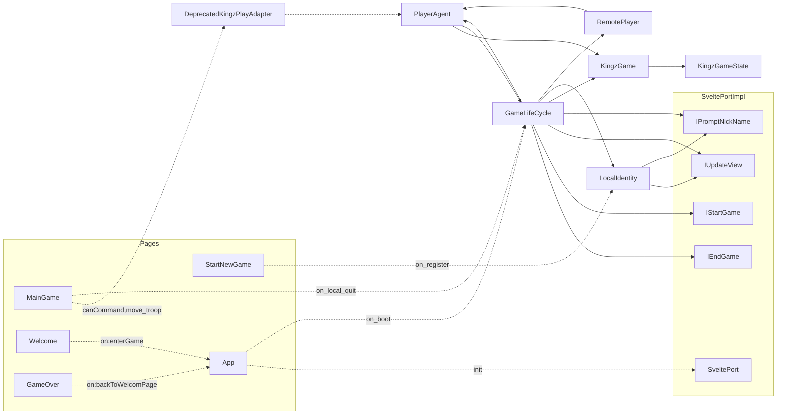
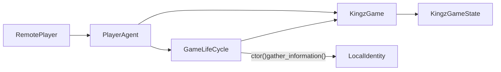

```mermaid
graph LR;

PlayerAgent --> KingzGame
PlayerAgent --> GameLifeCycle
KingzGame --> KingzGameState
GameLifeCycle --> IEndGame
GameLifeCycle --> IStartGame
GameLifeCycle --> IUpdateView
GameLifeCycle --> IPromptNickName

GameLifeCycle --> KingzGame
GameLifeCycle --> PlayerAgent
GameLifeCycle --> LocalIdentity
GameLifeCycle --> RemotePlayer
LocalIdentity --> IUpdateView
LocalIdentity --> IPromptNickName
RemotePlayer --> PlayerAgent

MainGame -.canCommand,move_troop.-> DeprecatedKingzPlayAdapter -..-> PlayerAgent
MainGame -.on_local_quit.-> GameLifeCycle
StartNewGame -.on_register.-> LocalIdentity

subgraph SveltePortImpl
	SveltePort
    IEndGame
    IStartGame
    IUpdateView
    IPromptNickName
end

App -.init.-> SveltePort
App -.on_boot.-> GameLifeCycle

subgraph Pages
	MainGame
	StartNewGame
	App
	Welcome -.on:enterGame.-> App
    GameOver -.on:backToWelcomPage.-> App
end

```

```mermaid
graph LR;

PlayerAgent --> KingzGame
PlayerAgent --> GameLifeCycle
KingzGame --> KingzGameState

GameLifeCycle --> KingzGame
GameLifeCycle -->|"ctor()gather_information()"| LocalIdentity
RemotePlayer --> PlayerAgent
```
